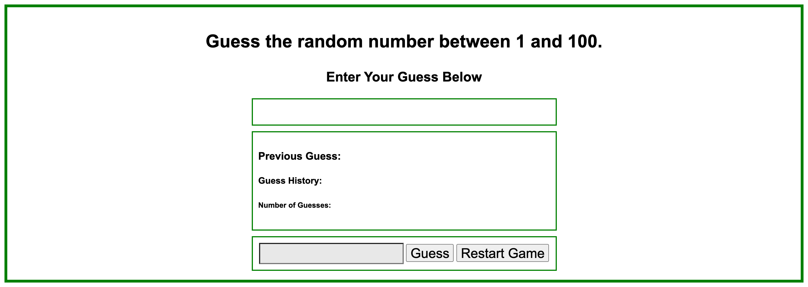
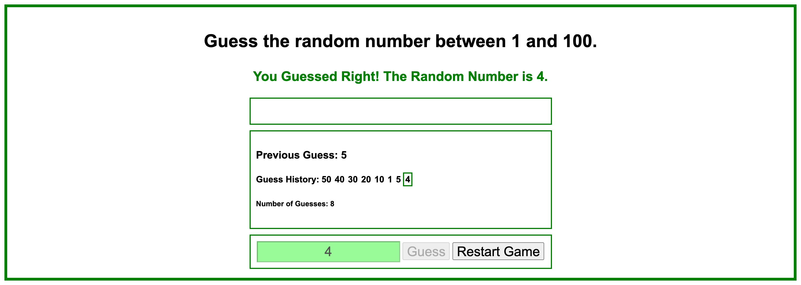
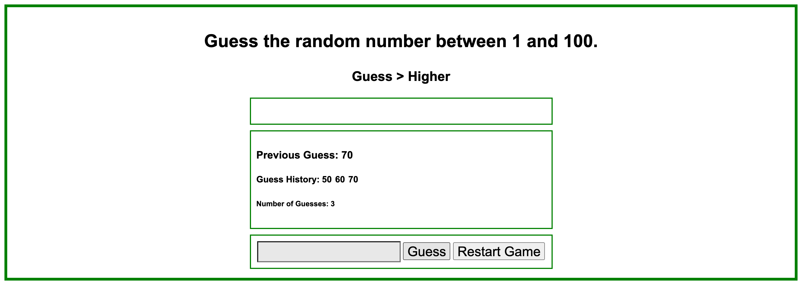
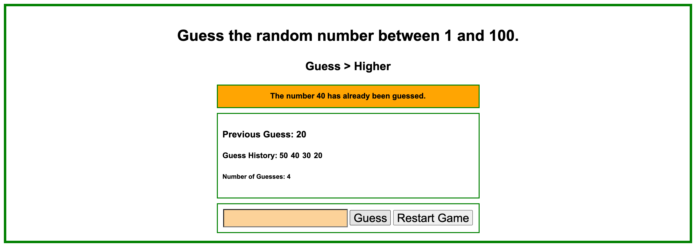

# Random-Number-Guessing-Game

## Project Overview

This is my implementation of a Random Number Guessing Game written in JavaScript that generates a number between 1 and 100.  The user is prompted to enter a number between 1 and 100 in the input field. The program then proceeds to determine if the number entered is the random number, higher than the random number, lower than the random number, a previously guessed number, not a valid number, or has exceeded the number of guesses allowed.

## Screenshots

